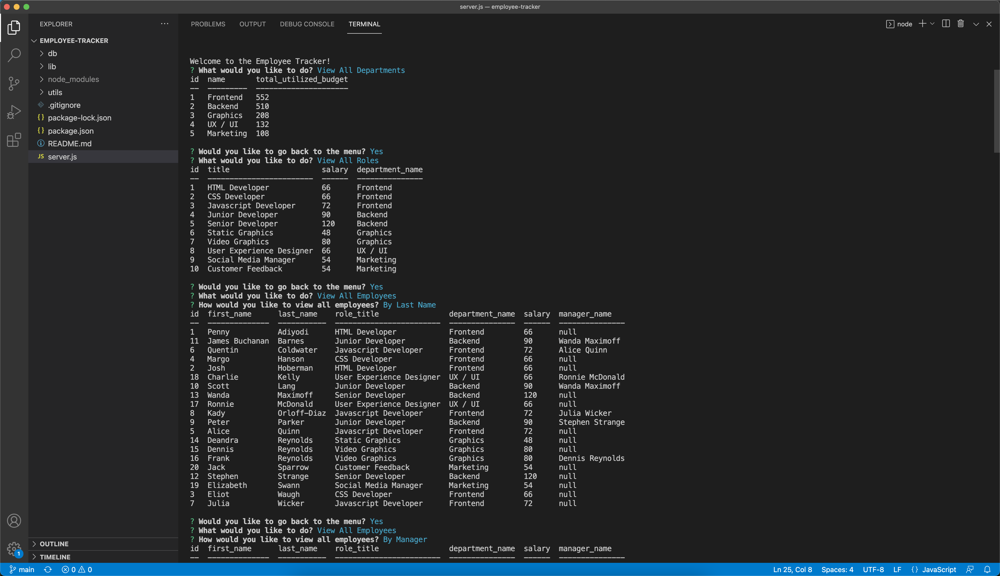

# Employee Tracker

This employee tracker allows business owners to manage the departments, roles, and employees through the command line. The user is able to select if they would like to view, which displays the respective tables, or add, edit, or delete, which then inquires further for more specific information to change. All information is stored in a SQL database.

## Video

View video of the working application: [Download Local File](https://github.com/JColeCodes/empire-sequel/raw/main/video/Employee%20Tracker.mp4) | [Google Drive](https://drive.google.com/file/d/1ZOPyhxvfkF5h4Q_yqwluuNLqwa25ljt-/view?usp=sharing)